# Architecture

`lddetective` is a single Rust binary with a library crate (`lddetective_lib`)
behind it. The pipeline is strictly linear: each stage consumes the previous
stage's output and produces normalized data for the next one. No stage reaches
backwards, and nothing touches the network.

```mermaid
flowchart LR
    A[evidence files / stdin / --live] --> B[evidence: collect, size caps, symlink guards]
    B --> C[parsers: timestamp normalization, envelope stripping]
    C --> D[events: normalized Event records with provenance]
    D --> E[storage: bounded EventStore]
    E --> F[timeline: chronological ordering + filters]
    F --> G[correlation: heuristic event pairs]
    G --> H[rules: built-in detection rules]
    H --> I[reporting: text / json / jsonl / csv]
```

## Stages

**Evidence** (`src/evidence.rs`) — Collects input units from a file, a
directory (recursive, with a symlink-escape guard), or stdin. Enforces size
caps (`MAX_FILE_BYTES`), per-line caps (`MAX_LINE_BYTES`), recursion depth,
and a per-run file count. Produces `Evidence` units plus `ParseStats` so the
report can say exactly what was skipped and why, instead of silently dropping
lines.

**Parsers** (`src/parsers/`) — A registry of parsers (`json`, `syslog`,
`auth`, `generic`). Whole-file parsers claim JSON documents; otherwise the
first lines of a file are sniffed, the best parser is locked in, and each
line is parsed. Lines the locked-in parser rejects are retried against the
others before being counted as skipped. See [parsers.md](parsers.md).

**Events** (`src/events.rs`) — The normalized record every parser produces:
timestamp (always with an explicit offset internally), type, subtype,
severity, process, user, addresses, message, and `Provenance` (source file,
line number, parser used, raw timestamp). See
[evidence-model.md](evidence-model.md).

**Storage** (`src/storage.rs`) — A bounded `EventStore`. When the configured
cap is exceeded, the oldest events are evicted and counted, so reports can
say "N oldest events were evicted" instead of silently losing them.

**Timeline** (`src/timeline.rs`) — Sorts by (timestamp, id) and applies
filters (time range, severity, type, process, source). Sorting is stable and
total: two events at the same timestamp keep id order.

**Correlation** (`src/correlation.rs`) — Pairs events that share signals
(same user, same pid, same process, same addresses) within a time window and
scores them with documented heuristic weights. Scores are signals, never
verdicts. See [correlation-engine.md](correlation-engine.md).

**Rules** (`src/rules/`) — Five built-in rules (AUTH-001, PRIV-001, PROC-001,
PROC-002, NET-001) written in deliberately cautious language. Findings say
"unusual" and "requires investigation", never "attack confirmed". Rules are
plain Rust behind a small trait, so new ones are easy to add. See
[threat-model.md](threat-model.md) for what the tool does and does not claim.

**Reporting** (`src/reporting.rs`) — Renders an `Investigation` (events,
findings, correlations, per-file statistics, time window) as text, JSON,
JSONL, or CSV. Terminal output is sanitized (ANSI escapes stripped) so
hostile log content cannot mess with the investigator's terminal.

**CLI** (`src/cli.rs`, `src/main.rs`) — `clap`-derived commands: `analyze`,
`timeline`, `report`, `inspect`, `live`, `rules`, `version`. Exit codes are
documented in `src/errors.rs`: 0 = done (even with findings), 1 = internal
error, 2 = usage/config error, 3 = evidence error.

**Live collection** (`src/linux.rs`, `src/collectors.rs`) — Read-only
snapshots of `/proc` (process list, network sockets), diffed across
intervals, converted to events. Privilege failures degrade to "unavailable"
markers instead of errors.

## Design principles

- **Local-first.** No network calls, no accounts, no telemetry. The tool
  works on an air-gapped machine.
- **Honest about uncertainty.** Naive timestamps are interpreted in local
  time and marked as such; syslog timestamps without a year are marked
  partial; correlation scores are labeled heuristics; rules use cautious
  language.
- **Never silent about loss.** Skipped lines, evicted events, and
  unreadable files are counted and reported.
- **Never execute log content.** Logs are data; nothing in them is run,
  interpolated into a shell, or rendered as terminal control sequences.
